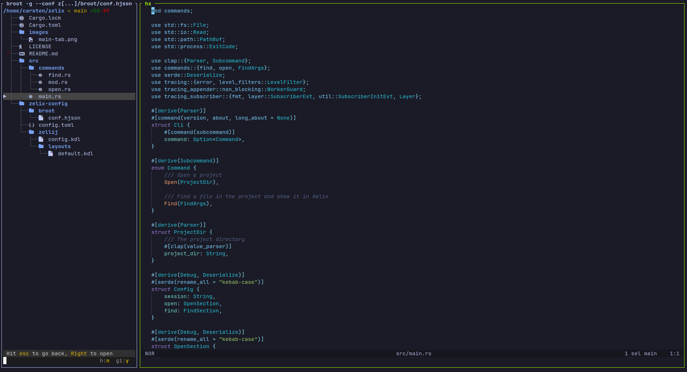

# Zelix

Zelix is a command-line tool that enhances the Helix editor by providing an IDE-like experience through the use of the terminal multiplexer Zellij. It supports integrating a file tree, such as Broot, to facilitate project overview and navigation.

Features:

- Per-Project Configuration: Customize your IDE setup for each project with configuration files.
- Subcommands: Zelix works with subcommands to manage its functionality.
- Rust implementation: Written in Rust to keep future development options open, ensuring scalability and performance.
- Via Zellij: Integrated terminal, diff tab, build shortcuts, and more.

Self-Documentation:

Zelix includes configuration files in the `zelix-config` subfolder, demonstrating how to use Zelix to develop Zelix. It should be easy to derive configurations for other project from there.

Here is how the first of three tabs looks on my machines when opening the Zelix project with Zelix:



## General requirements for Zelix

Ensure that the following tools are installed on your system:

- Helix.
- Zellij.
- File tree (optional): Broot or any other file tree that can be configured to call a command with the chosen file as an argument.

## Installation

With Zelix being new and needing feedback from early adopters, I recommend to clone Zelix and install it locally with Cargo:

```sh
https://github.com/cfuehrmann/zelix.git
cd zelix
cargo install --path .
```

That should make the `zelix` command available to you, while also giving you the Zelix project as a playground for your own configuration.

## Usage

Before using Zelix in your own project, it’s recommended to first experiment with the Zelix project itself to iron out any configuration issues on your machine:

```sh
zelix open ~/zelix # Replace '~/zelix' with the correct path on your system
```

This may require some adjustments:

- Helix: The file `zelix-config/zellij/layouts/default.kdl` assumes that the Helix command is `hx`. If the command differs on your system, change it in that file.
- Terminal emulator: You can configure in `zelix-config/config.toml` which terminal emulator to use. The current choice is Alacritty. Change it if you prefer another terminal emulator.
- Broot: The Zelix project uses Broot as the file tree. (While Zelix can use any file tree in other projects.)
  - The `find` subcommand in `zelix-config/broot/conf.hjson` assumes that the Zelix project resides in `~/zelix`. Change that if necessary.
  - The file `zelix-config/layouts/default.kdl` assumes that you have a user-wide Broot config `../.config/broot/conf.hjson` (typically `..` is your home directory). Change that path if it differs on your system. Note that, due to a Zellij restriction, the tilde `~` and the environment variable `$HOME` cannot be used in that path.
- Shell: The second tab in `zelix-config/zellij/layouts/default.kdl` uses the Fish shell. Change it if you prefer a different shell.
- Difftastic (optional): The third tab runs `git diff`. For better output, install difftastic and configure Git to use it.
- Themes (optional): Harmonize your Broot and Helix themes for a consistent look.

> Note: Zelix writes logs to files named `zelix.log.yyyy-mm-dd` in the `zelix-config` directory. Check these files if you encounter issues.

Once Zelix opens successfully, try the file tree: Navigate to some file, with Tab or Shift+Tab, or by entering some characters to fuzzy-find a file. Then press enter to open the file in Helix. If this does not work, please check the logs.

Then use Zellij shortcuts Alt+h and Alt+l to switch between tabs:

- Tab 1: File tree and Helix.
- Tab 2: Your preferred shell.
- Tab 3: git diff output. It initially appears empty; restart git diff by pressing 'q' and then Enter.

Finally, while in the Helix pane, build Zelix with the shortcut Ctrl+b as defined in `zelix-config/zellij/config.kdl`.

## Adapting Zelix for your projects

When you are satisfied with the Zelix project setup, use it as a template for your own projects. Copy the `zelix-config` folder to your project and adjust the configuration files as needed.
